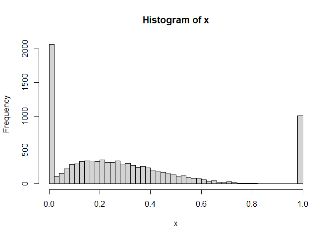

<!-- README.md is generated from README.Rmd. Please edit that file -->

# zoabeta: An R package for the zero-one-augmented beta distribution

<!-- badges: start -->

<!-- badges: end -->

The zoabeta package is a very simple implementation of the
zero-one-augmented beta distribution that supports values on the unit
interval (e.g. proportions or probabilities) that might include zero or
one values, in contrast to the standard beta distribution which does not
support zero or one values. The package provides density, probability,
quantile and random variate functions analogous to the standard beta
distribution functions in the R `stats` package.

## Installation

You can install the development version of zoabeta from
[GitHub](https://github.com/) with:

``` r
# Using the pak package
# install.packages("pak")
pak::pak("mbedward/zoabeta")

# Or using the remotes package
# install.packages("remotes")
remotes::install_github("mbedward/zoabeta")
```

## Examples

Generate random values:

``` r
library(zoabeta)

# Generate random values where there is a 0.2 probability of zero and a 
# 0.1 probability of one, with intermediate values following a beta(2, 5) 
# distribution

x <- rzoabeta(n = 1e4, shape1 = 2, shape2 = 5, pzero = 0.2, pone = 0.1)
hist(x, breaks = 40)
```


